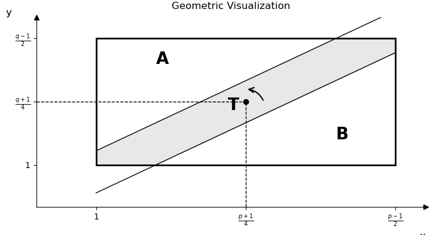

# Number Theorem 11th note

### Theorem 11.1 (Quadratic reciprocity)

If $p$ and $q$ are distinct odd primes, then

$$\left( \frac{q}{p} \right) = \left( \frac{p}{q} \right)$$

except when $p \equiv q \equiv 3\operatorname{mod}4$, in which case

$$\left( \frac{q}{p} \right) = - \left( \frac{p}{q} \right)$$

or equivalently

$$\left( \frac{q}{p} \right)\left( \frac{p}{q} \right){= ( - 1)}^{\frac{(p - 1)(q - 1)}{4}}$$

#### Pf

Let $P = \left\{ 1,2,\ldots\frac{,(p - 1)}{2} \right\} \subset U_{p}$
and $N = ( - 1) \cdot P$ as before, and let
$Q = \left\{ 1,2,\ldots\frac{,(q - 1)}{2} \right\} \subset U_{q}$. By
Gauss's lemma, $\left( \frac{q}{p} \right){= ( - 1)}^{\mu}$, where
$\mu = |qP \cap N|$ is the number of elements $x \in P$ s.t.
$qx \equiv n\left( \operatorname{mod}p \right)$.

This congruence is equivalent to $qx - py \in N$ for some
$y \in {\mathbb{Z}}$, that is ^(1)^$- \frac{p}{2} < qx - py < 0$ for
some $y \in {\mathbb{Z}}$.~控制~ Given any $x \in P$, it is clear that
(1) holds for at most one $y \in {\mathbb{Z}}$. If such $y$ exists, then
$0 < \frac{qx}{p} < y < \frac{qx}{p} + \frac{1}{2}$. But
$x \leq \frac{p - 1}{2}$ so
$y < \frac{q}{p}\frac{p - 1}{2} + \frac{1}{2}\frac{< (q + 1)}{2}$.

Thus $y$ is in feat in $Q$! Therefore, $\mu$ is the number of pairs
$(x,y) \in P \times Q$ such that (1) holds.

Interchanging the roles of $p$ and $q$, we also have
$\left( \frac{p}{q} \right){= ( - 1)}^{\nu}$, where $\nu$ is the number
of pairs $(x,y) \in P \times Q$ such that

$${}^{(2)}0 < qx - py < \frac{q}{2}$$

It follows
that$\left( \frac{q}{p} \right)\left( \frac{p}{q} \right){= ( - 1)}^{\mu + \nu}$,
where $\mu + \nu$ is the number of pairs $(x,y) \in P \times Q$ such
that (1) or (2) holds.

But there are no pairs $(x,y) \in P \times Q$ satisfying $qx - py = 0$
as $\gcd(p,q) = 1$. So the condition can be simplified to
$- \frac{p}{2} < qx - py < \frac{q}{2}$.^(3)^

The strip $S$ defined by (3) splits the rectangle $R = P \times Q$ into
$3$ parts.

So it suffice to show that $A$ and $B$ have the same number of integer
points. But $A$ and $B$ can be easily identified via the half turn.

### Ex 11.3

If $p \equiv 1\operatorname{mod}4$.

$$\left( \frac{3}{p} \right) = \left( \frac{p}{3} \right) = \begin{cases}
1, & \begin{aligned}
p \equiv 1\operatorname{mod}3, & \text{that is }p \equiv 1\operatorname{mod}12
\end{aligned} \\
 - 1, & \begin{aligned}
p \equiv 2\operatorname{mod}3, & \text{that is }p \equiv 5\operatorname{mod}12.
\end{aligned}
\end{cases}$$

If $p \equiv 3\operatorname{mod}4$.

$$\left( \frac{3}{p} \right) = \left( - \frac{p}{3} \right) = \begin{cases}
 - 1, & \begin{aligned}
p \equiv 1\operatorname{mod}3, & \text{that is }p \equiv 7\operatorname{mod}12
\end{aligned} \\
1, & \begin{aligned}
p \equiv 2\operatorname{mod}3, & \text{that is }p \equiv 11\operatorname{mod}12.
\end{aligned}
\end{cases}$$

In summary, we see that $3 \in Q_{p}$ iff $p = 2$ or
$p \equiv \pm 1\operatorname{mod}12$.

### Corollary 11.4 (Pepin's test for primality of $F_{n} = 2^{2^{n}} + 1$)

If $n \geq 1$, then the Fermat number $F_{m}$ is prime iff

$$3^{\frac{F_{n} - 1}{2}} \equiv - 1\operatorname{mod}F_{n}$$

#### Pf.

##### (=\>)

It is easily seen that
$F_{n} \equiv 5\operatorname{mod}12\begin{pmatrix}
2\operatorname{mod}3 \\
1\operatorname{mod}4
\end{pmatrix}$.

By Ex 11.3, $3 \notin Q_{p}\left( p = F_{n} \right)$. Then Euler's
criterion gives

$$
3^{\frac{p - 1}{2}} \equiv - 1\operatorname{mod}p
$$

##### (\<=)

For the converse, suppose that
$3^{\frac{F_{n} - 1}{2}} \equiv - 1\operatorname{mod}F_{n}$, then
squaring $3^{F_{n} - 1} \equiv 1\operatorname{mod}F_{n}$ and thus
$3^{F_{n} - 1} \equiv 1\operatorname{mod}p$ for $p|F_{n}$.

As an element of $U_{p}$, $3$ has order $m|F_{n} - 1 = 2^{2^{n}}$, so
$m = 2^{i}$ for some $i \leq 2^{n}$. Now
$3^{2^{2^{n - 1}}} = 3^{\frac{F_{n} - 1}{2}} \equiv - 1 ≢ 1\operatorname{mod}p$,
so $i = 2^{n}$ and $m = 2^{2^{n}} = F_{n} - 1$. However,
$m \leq \varphi(p) = p - 1$, so $F_{n} \leq p$ and hence $F_{n} = p$ is
prime.

**HW:** Are $11$ and $29 \in Q_{1129}$

**HW:** 7.12

### Def 11.5

The Jacobi symbol $\left( \frac{a}{n} \right)$ is a natural
generalization of the Legendre symbol defined for any positive odd
integer $n$:

$$\left( \frac{a}{n} \right){= \left( \frac{a}{p_{1}} \right)}^{e_{1}}\ldots\left( \frac{a}{p_{k}} \right)^{e_{k}},\text{ where }n = p_{1}^{e_{1}}\ldots p_{k}^{e_{k}}\text{ is the p.p.f of }n$$

**HW**

Show that if $\left( \frac{a}{n} \right) = - 1$ then
$a \notin Q_{n}$.(the converse is clearly wrong)

Show that for $m$ and $n$ odd positive coprime integers, we have the law
of quadratic reciprocity.

$$\left( \frac{m}{n} \right) \cdot \left( \frac{n}{m} \right) = ( - 1)^{\frac{(m - 1)(n - 1)}{4}}$$

$$H_{1},H_{2}\text{ 子群 } \subset G,\begin{cases}
\langle H_{1} \cup H_{2}\rangle = G \\
H_{1} \cap H_{2} = \left\{ e \right\}
\end{cases},G ≌ H_{1} \times H_{2}$$

### Ex 11.6

Let $n = 100 = 2^{2} \cdot 5^{2}$. Then $a \in Q_{100}$ iff
$\begin{cases}
a \in Q_{5} = \left\{ 1,4 \right\} \\
a \in Q_{4}\left( \text{ie. }a \equiv 1\operatorname{mod}4 \right)
\end{cases}$

We immediately get from CRT that

$$Q_{100} = \left\{ 1,21,41,61,81,9,29,49,69,89 \right\}.$$

Any of them has $4$ square roots. To find square roots of say $29$, we
first find its square roots $\operatorname{mod}4$ and
$\operatorname{mod}25$ respectively.

There are $\pm 1\left( \operatorname{mod}4 \right)$ and
$\pm 2\left( \operatorname{mod}25 \right)$, so by CRT again square roots
$\operatorname{mod}100$ are $\left\{ 23,27,73,77 \right\}$. We thus
found all numbers $b$ s.t. the last digits of $b^{2}$ are $29$.

**HW:** List all elements in $Q_{108}$ and find the square roots of
$37\operatorname{mod}108$

### Ex 11.7

Recall from Ex 3.13 that we claimed for each $n \in {\mathbb{N}}$ there
is a solution for
$f(x) = \left( x^{2} - 13 \right)\left( x^{2} - 17 \right)\left( x^{2} - 221 \right) \equiv 0\operatorname{mod}n$.

By CRT it suffices to show that the solution exists for each
$n = p^{e}$. This is clearly equivalent to that at least one of $13,17$
and $221 = 13 \cdot 17$ us a quadratic residue $\operatorname{mod}p$. By
Theorem 10.3,
$\left( \frac{221}{p} \right) = \left( \frac{13}{p} \right)\left( \frac{17}{p} \right),(p \neq 2,13,17)$
Then at least one of $13,17$ or $221$ must be in $Q_{p}$.

Finally we need to consider the case when $p = 2,13,17$. But it is easy
to find a solution in these cases.

**Problem**

An $n \times n$ matrix $H$ with all entries $\pm 1$ and satisfies
$H \cdot H^{T} = n \cdot I_{n}$ is called a Hadamard matrix of order
$n$.

It is an easy observation that $H$ is a Hadamard matrix of order $n$,
then $n = 1,2$ or $n \equiv 0\operatorname{mod}4$.

Conjecturally there exists a Hadamard matrix of order $n$ whenever
$4|n$. (as of today the least $n$ for which no $H$ is construeted is
$668$)

-   $n = q + 1,q \equiv 3\operatorname{mod}4$

-   $n = 2(q + 1)q \equiv 1\operatorname{mod}4$

1.  $\sum_{a \in {\mathbb{Z}}_{q}}\left( \frac{a}{q} \right) = 0$

2.  if $b \in U_{q}$, then
    $\sum_{a} \in {\mathbb{Z}}_{q}\left( \frac{a}{q} \right)\left( \frac{b + a}{q} \right) = - 1$

### Def 12.1 [^1]

An arithmetic function is a function $f(n)$ defined for all
$n \in {\mathbb{N}}$, it is usually complex valued. An arithmetic
function $f$ is called multiplicative if $f(mn) = f(m) \cdot f(n)$
whenever $m$ and $n$ are coprime.

### Rmk 12.2

Any multiplicative arith fun. is completely determined by its value on
prime powers.

### Ex 12.3

Completely multiplicative:

1.  Identity $\text{Id } \rightarrow \text{ Id}_{k}$ (where $k = 0$ is
    constently 1)

2.  unit function $\varepsilon(n) = \begin{cases}
    1, & \text{if }n = 1 \\
    0, & \text{otherwise }
    \end{cases}$

3.  Legendre (Jacobi) symbol, (or more generally Dirichlet character)

just multiplicative:

1.  $\gcd(n,k)$($k$ fixed)

2.  Euler's $\varphi$

3.  divisor function
    $\sigma_{k}\left( \sigma_{k}(n) = \sum_{d|n}d^{k} \right)$

4.  $|Q_{n}|$ the number of quadratic residues.

### Rmk 12.4

An arithmetic function $f$ is called additive if $f(mn) = f(m) + f(n)$,
whenever $m$ and $n$ are coprime. Through exponentials additive function
will be multiplicative.

The number of prime divisors $\Omega(n)$(with multiplicity), and
$\omega(n)$( without multiplicity) are additive.

### Ex 12.5 (Liouville's $\lambda$)

$\lambda(n){= ( - 1)}^{\Omega(n)}$. In general, we define
$\lambda_{k}(n) = k^{\Omega(n)}$.

### Ex 12.6 (Dedekond's $\Psi$)

We defined a multiplicative function $\psi$ by
$\psi(p^{e}) = (p + 1) \cdot p^{e - 1}$. Then
$\psi(n) = n \cdot \prod_{\left( p|n \right)\left( 1 + \frac{1}{p} \right)}$.

### Ex 12.7 (Ramanujan's sum)

$C_{k}(q)$ is the sum of the $k$-th powers of the primitive $q$-th roots
of unity.

$$C_{k(q)} = \sum_{1 \leq a \leq q,\gcd(a,q) = 1}e^{2\pi i\frac{a}{q}k}$$

(is multiplicative)

### Prop 12.8

The divisor function $\sigma = \sigma_{1}$ is multiplicative. Will give
a short proof next lecture.

### Corollary 12.9

If $n$ has a p.p.f. $n = p_{1}^{e_{1}}\ldots p_{k}^{e_{k}}$, then
$\sigma_{0}(n) = \prod_{i = 1}^{k}\left( e_{i} + 1 \right)$ and
$\sigma_{1}(n) = \prod_{i = 1}^{k}\left( \frac{p_{i}^{e_{i}} + 1}{p_{i} - 1} \right)$

[^1]: 原文序号如此
