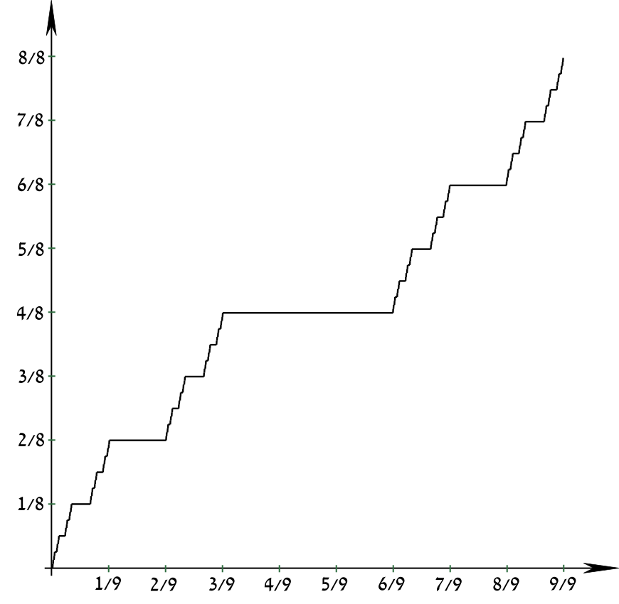

# 实变函数笔记20250314

### 推论

$\exist A,B\subseteq \R, A\cap B=\emptyset,\ s.t.\ m^*(A\cup B)<m^*(A)+m^*(B)$

### Cantor-Lebesgue 函数

Cantor-Lebesgue 函数$\phi(x)$为$[0,1]\rightarrow[0,1]$的单调满射，注意到$a.e.\ \phi'(x)=0$

$\psi(x)=\frac{1}{2}(\phi(x)+x)$ 为 $[0,1]\rightarrow[0,1]$ 的连续严格单调递增的双射函数，易知 $\psi^{-1}(x)$ 存在

### 命题

$\psi(\mathcal C)$可测且$m(\psi(\mathcal C))=\frac{1}{2}$

### 非 Borel 集可测集的存在性

已知 $m(\psi(\mathcal C))=\frac{1}{2}>0$  
由 Vitali 定理知$\exists$ 不可测集 $E\subset \psi(\mathcal C)$  
考虑 $\psi^{-1}(E)\subset \mathcal C$  
由 $m(\mathcal C)=0$ 推知 $m(\psi^{-1}(E))=0$，即 $\psi^{-1}(E)$ 为零测集  
故 $\psi^{-1}(E)$ 可测

### 命题

综上，有 Borel 集合$\mathcal B\subsetneq$ 可测集 $\mathcal M\subsetneq 2^\R$

--- 
## 第三章 可测函数

### 可测函数定义

$E$可测（此条件后文默认），$f:E\rightarrow \bar\R:=\R\cup\{-\infty,+\infty\}$，则下述命题等价：

1. $\forall c\in\R,\{x\in E; f(x)>C\}$可测
2. $\forall c\in\R,\{x\in E; f(x)\geq C\}$可测
3. $\forall c\in\R,\{x\in E; f(x)<C\}$可测
4. $\forall c\in\R,\{x\in E; f(x)\leq C\}$可测

若上述命题成立，则将$f$称为(Lebesgue)可测

$f$ 可测 $\Rightarrow\forall c\in\bar\R,\ \{x\in E;\ f(x)=c\}$可测

### 命题

$f:E\rightarrow \R$ 可测 $\Rightarrow \forall U\subseteq \R$为开集，$f^{-1}(U)$可测

### 推论

1. 连续函数均可测
2. 设$f:E\rightarrow \R$可测，$g:F\rightarrow \R$连续，$f\supseteq f(E)$，则有$g\circ f:E\rightarrow\R$ 可测

    特别地，$f$可测$\rightarrow \frac{1}{f}$可测，$\forall p\in (0,+\infty),|f|^p$可测

### 命题

1. $f$ 可测，$a.e.\ g=f$，则$g$可测
2. 设$E=E_1\cup E_2$，则$f$可测$\Leftrightarrow f|_{E_1},f|_{E_2}$均可测

### 注意

$f$处处有限 $\not=f$有界

### 命题

设定义域相同的两函数$f,g$均可测且$a.e.$ 有限

1. $\forall \alpha,\beta\in\R,\ \alpha f+\beta g$可测
2. $f(x)g(x)$ 可测

### 命题

$\{f_i\}_{i=1}^n$可测，则有$\max\{f_1,\dots,f_n\},\min\{f_1,\dots,f_n\}$均可测

定义$f^+:=\max\{f,0\};f^-:=\max\{-f,0\};$  
则有

1. $f=f^+-f^-$
2. $f$可测$\Leftrightarrow f^+,f^-$均可测
3. $|f|=f^++f^-$；$f$可测$\Rightarrow |f|$可测

### 命题

$\{f_i\}_{i=1}^{\infty}$ 可测，则$\sup f_i,\inf f_i,\limsup f_i,\liminf f_i$均可测 

### 命题

$\{f_i\}_{i=1}^{\infty}$ 可测，$f_i$几乎处处收敛为$f$（$f_i\rightarrow f\ a.e.$）则 $f$ 可测

> 几乎处处收敛：在除去一个零测集上点点收敛